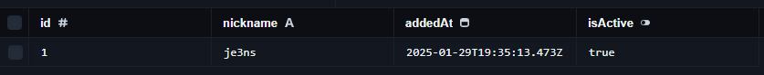

# MiracleWhitelist

That plugin only works on Velocity proxy and only with PostgreSQL, but you can use MySQL or anything else.

Read HikariCP docs if you want to customize the plugin.

The plugin checks if user record is available in database and that record is active.

## Todos:
- Time limited whitelist
- Local database
- ~~Commands~~

